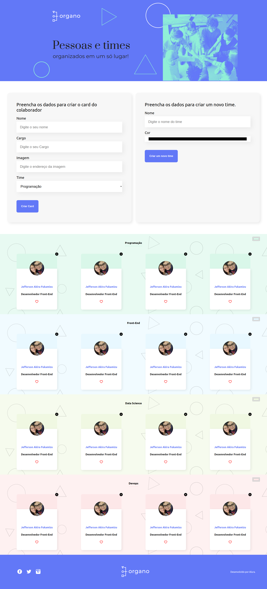

# Organo

Esse é um projeto desenvolvido  durante o curso da alura React: desenvolvendo com javascript, que passa toda base introdutória do react e suas funcionalidades.

## Link do Projeto
[Para acessar o link do projeto clique aqui](https://organo-ochre.vercel.app/)

## Tecnologias Utilizadas

-React

## Instalação 

- Utilize o `npm install` para instalar as dependências do projeto
